# 🌹White Rose

Welcome to another exhilarating episode of “How To Break Into a Bank—The Legal Way!” Today’s victim: the prestigious-sounding but not-so-prepared Cyprus National Bank. Let’s take a comedic stroll through their defenses with some professional flair (**and a raised eyebrow or two**).

## 1. Introduction&#x20;

## 👋 Hi, I’m Shivam (taauxick)

A curious mind with a keyboard, currently diving deep into the world of ethical hacking and CTFs. I enjoy poking around where I shouldn’t (legally, of course), and turning misconfigurations into opportunities.\
This writeup walks through my process of breaking into the “White Rose” lab — from login to root — with some sarcasm, a bit of bash, and a whole lot of fun.



Check out my portfolio showcasing projects, write-ups, and my journey in cybersecurity:&#x20;



Here, we’re not just hacking for the thrill. We’re hacking because these admin panels practically beg for attention. If you’re not exploiting EJS or privilege escalation, are you even pentesting?

## 2. Initial Recon: Web Page and RustScan

First things first, point your browser to cyprusbank.thm and get that oh-so-welcome maintenance message. This is the classic sign—they have something to hide (besides their insecure coding practices).

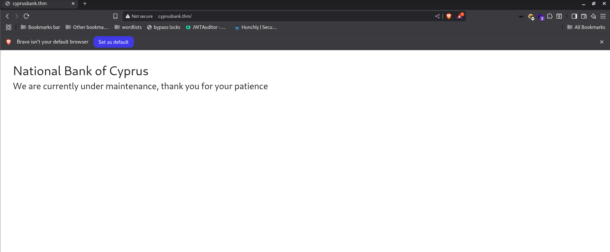

## RustScan - The Modern Day Blitz

&#x20;   Crack open RustScan and blast the target:

```
rustscan -a cyprusbank.thm -r 1-65535 -- -sV -sT -A
```

* **Fastest results in the West**: RustScan’s multithreaded magic can rip through all 65,535 ports and make Nmap look like a tortoise with a limp.

Found the classics: **22 (SSH)** and **80 (HTTP)** wide open. Because "security by tradition" never goes out of style.

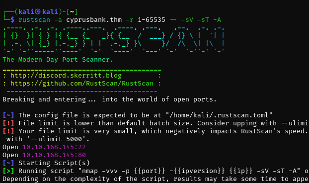

## 3. Subdomain Fuzzing — Because Admin Panels Love to Be Found

Why settle for www when “admin” is always lurking in the shadows? Enter ffuf:

```
ffuf -u http://cyprusbank.thm/ -H "Host: FUZZ.cyprusbank.thm" -w [wordlist] -t 50 -mc 200,302,401,403 -fs 57
```

* The result? Both `www` and `admin` subdomains. The latter is predictably hiding the admin panel. Shocking, I know.
* Pro-tip: When admins try to act “stealthy” with their subdomains, fuzzing laughs in their fac

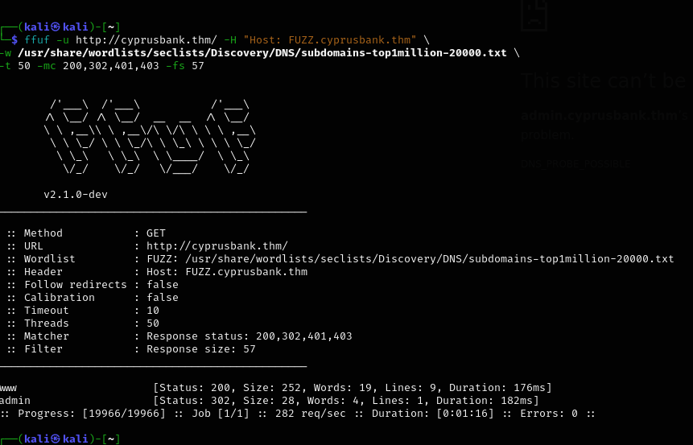

## 4. Login: Used the provided credentials to log in—because apparently, ‘Olivi8’ was the peak of their password complexity policy.

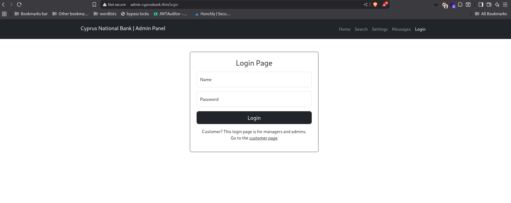

*   They left the door ajar:

    * Username: `Olivia Cortez`
    * Password: `olivi8`

    Because who doesn’t secure sensitive admin portals with credentials that could be cracked by a toddler with a sticker chart?

So, we log in

&#x20;

<figure>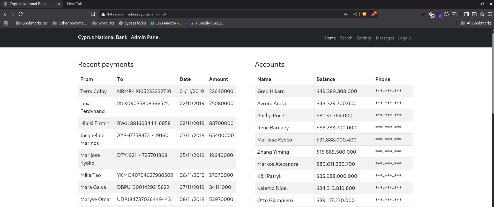<figcaption></figcaption></figure>

and are greeted with masked mobile numbers. It's like the app is whispering: “Yes, there’s data here… but no, you can't have it.”

Then we find the **settings page**—

<figure>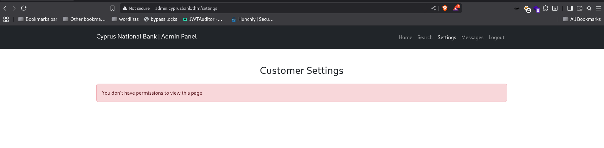<figcaption></figcaption></figure>

oh, how promising it looked—until i met another rejection😔

Denied, Because apparently, _access control is still a thing_. But worry not, our nosy instincts tell us there's more underneath.

## The Curious Case of Customer Chats

While casually scrolling through the interface and pretending to behave, **some chat snippets caught my eye**. They weren’t just idle chatter—**they were clearly up to something**.

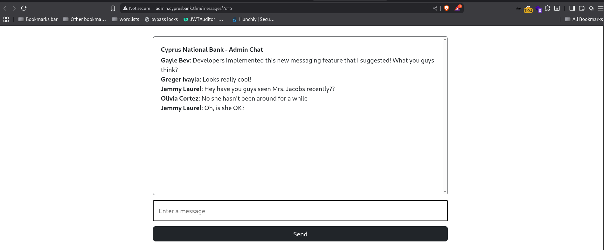

Customer messages, half conversations, vague references—it all smelled like something worth uncovering. Not actionable yet, but a solid hint that **more sensitive data or functionality** might be hidden deeper in the app. So I took note and kept digging.

Because if there’s one thing worse than a vulnerable app, it’s a vulnerable app trying to hide its mistakes in plain sight.

## **5. The “?c=5” Curiosity — Classic Parameter Fiddling**

Here comes our favorite pentester pastime: **parameter tampering**.

We spot this juicy `?c=5` in the URL. Naturally, we try `?c=1`, expecting nothing... but surprise! A flashback message I had just dropped reappears. So, I start climbing the ladder:

* `?c=2` → already saw
* `?c=3` → hmm
* `?c=4` → looks interesting...
* `?c=5` → hmm.....
* `?c=6` → ohh waitt....
* `?c=9` → damnnn.........
* `?c=11` → jackpottttttttttttttttttt
* `?c=22?` → just a prank , Hehe...

**Privileged user password—literally sitting there** like it's waiting to be claimed.

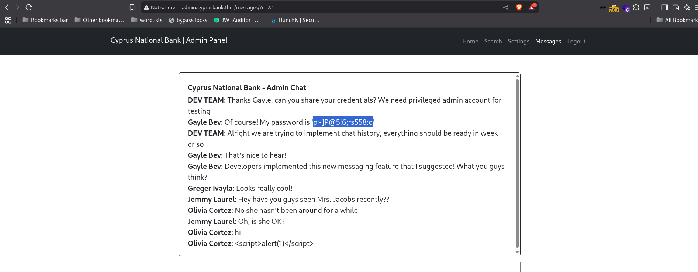

## 6. Logging in as the VIP

Armed with this **golden password**, I log in again—this time as the elite class. Guess what changes?

➡️ **Unmasked mobile numbers.**

Because, sure, why bother encrypting data when you can just hide it behind a privilege flag?

Anyway, from here, we extract **Tyrell Wellick’s** number, and ✅ Task 1 is done.

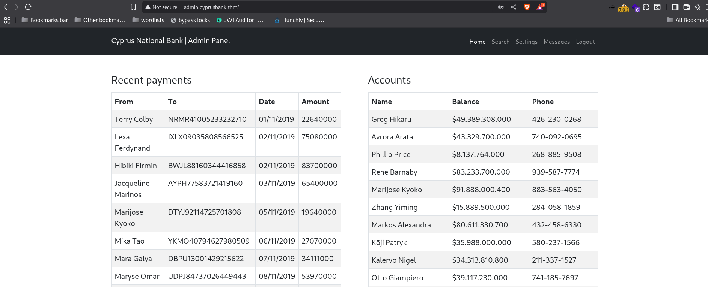 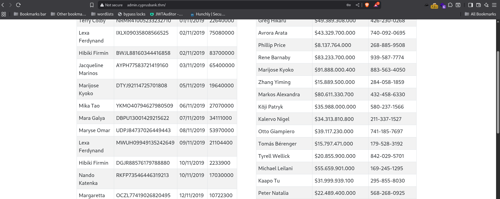

## 7. Shell Season: Enumerating for RCE

Now with VIP access, we return to the **settings page**, and what do we see? A shiny new option to update your password.

<figure>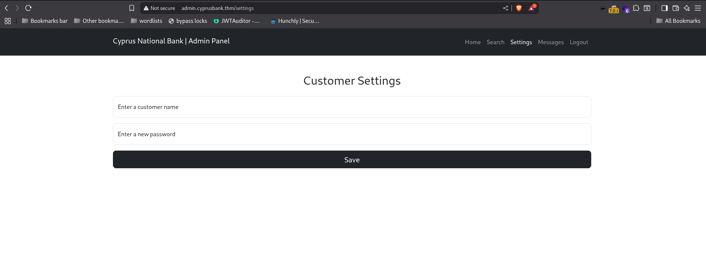<figcaption></figcaption></figure>

"With just a username switch and a password update to ‘taauxick’, I assumed a whole new identity. Who knew identity theft could be a built-in feature?"

<figure>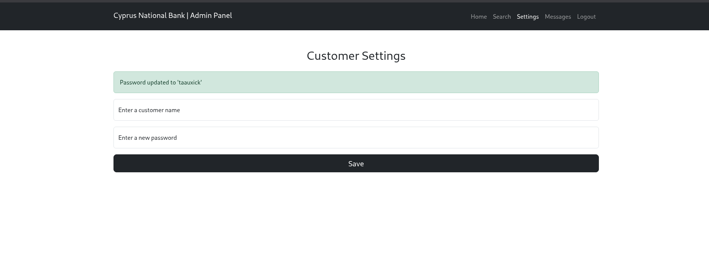<figcaption></figcaption></figure>

## 8. Tampering With Requests: EJS Template Mishaps

So, I did what any respectful hacker would do—open Burp Suite and **poke it mercilessly**.

* Removed the `password` field from the request
* Boom: stack trace
* Hello EJS error: `password is not defined`

EJS errors are like breadcrumbs to a buffet—**they usually mean template injection is on the menu.**

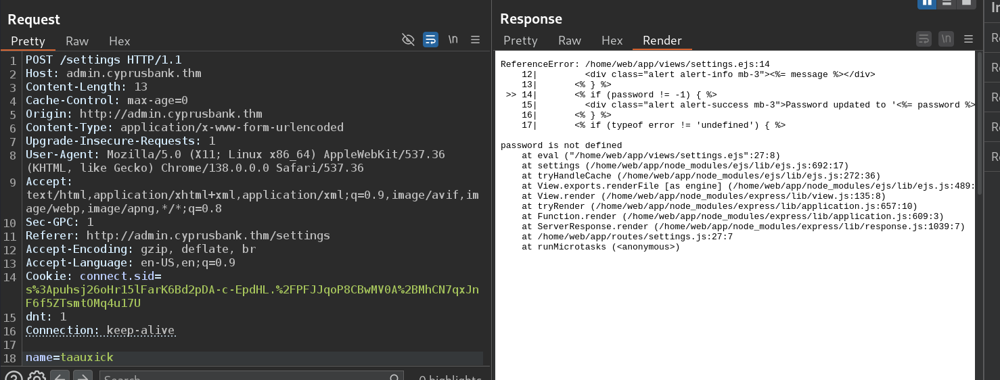

## 9. Digging Deeper (with a little help from AI & Google)

The moment I saw:

`<%= password %>`

…my pentester brain, ChatGPT, and a couple of GitHub issues (_shoutout to mde/ejs #720_) all agreed: this might be vulnerable to **SSTI (Server-Side Template Injection)**.



Injecting the Template — SSTI Achieved

And bingo—**command execution**. No need for a crystal ball here; the server's giving us execution rights on a silver platter.

<figure>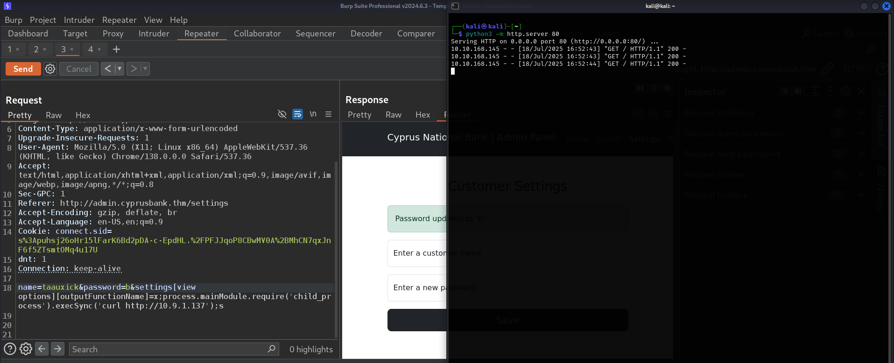<figcaption></figcaption></figure>

We weaponize it with a reverse shell from revshell, then launch:

..I executed the payload, and within seconds: **shell access as the `web` user**.

No authentication tokens, no JWTs, no fancy bypasses—just EJS, a broken trust model, and one poorly-handled input field.

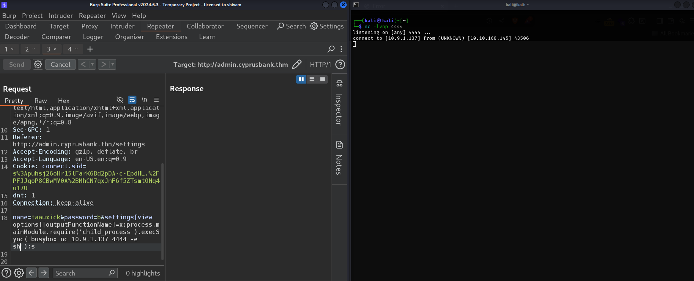

## 10. A Shell Named `web`

Once inside, the prompt greeted me as the **`web` user**—exactly what I expected, and everything I needed.

At this point, I was one step away from privilege escalation, but the hard part was already over. The rest? Just a matter of seeing what the `web` user could touch that it really shouldn’t.

but before that........

**Shell Stabilization — Because Raw Shells Are So Last Season**

So we had a shell. But not a **real** shell. You know, the kind that makes `arrow keys` cry and `Ctrl+C` commit self-destruction.

Let’s fix that, the proper way:

<figure>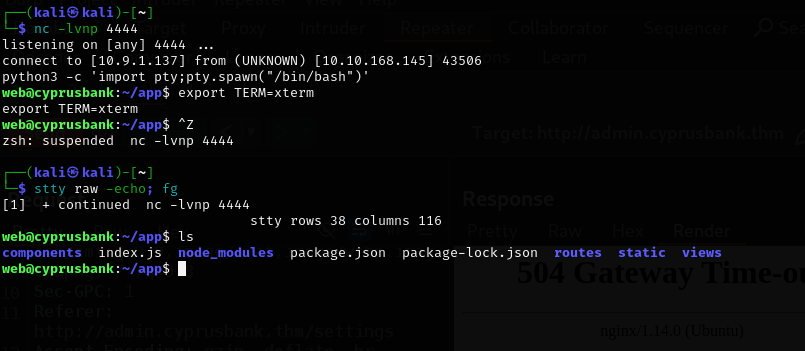<figcaption></figcaption></figure>

Now we’re in **TTY heaven**—scrolling, tabbing, and navigating like civilized shell users. No more typing blind.

## 11. Capturing the `user.txt` Flag — Obligatory Loot Phase

With a functional shell and `web` user access, it’s time for the ritualistic flag hunt. A quick snoop into `/home/web/` (because where else?) and voilà:

<figure><figcaption></figcaption></figure>

## 12. From Web to Root — Because Why Stop Now?

The usual:

`sudo -l`

reveals that we can run `sudoedit` on a specific config file.

But thanks to an old trick (and a dev who read the CVE but said “nah”), we abuse:

<div data-full-width="true">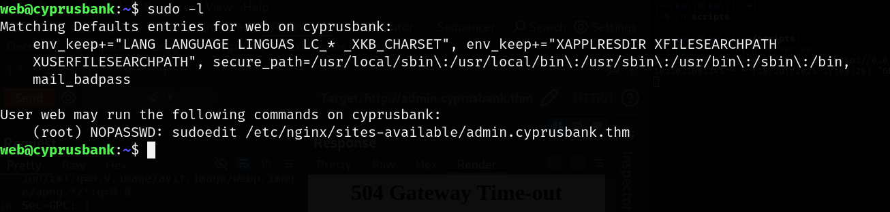 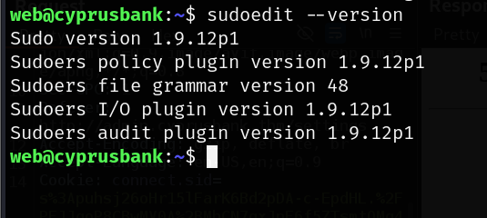</div>




[https://www.synacktiv.com/sites/default/files/2023-01/sudo-CVE-2023-22809.pdf](https://www.synacktiv.com/sites/default/files/2023-01/sudo-CVE-2023-22809.pdf)

### Step 1:

`export EDITOR="vim -- /etc/sudoers"`

* You're setting the environment variable `EDITOR` to run `vim` with two arguments:
  * `--`: End of options (POSIX standard)
  * `/etc/sudoers`: the **malicious extra file** you want to edit

***

### Step 2:

`sudoedit /etc/nginx/sites-available/admin.cyprusbank.thm`

* Normally allows you to edit only the file: `/etc/nginx/sites-available/admin.cyprusbank.thm`
*   But due to the CVE, the command becomes:

    &#x20;

    `vim -- /etc/sudoers -- /etc/nginx/sites-available/admin.cyprusbank.thm`

### ➤ **Result:**

* You now have access to edit **both**:
  * `/etc/sudoers`
  * `/etc/nginx/sites-available/admin.cyprusbank.thm`
* add web ALL=(ALL:ALL) NOPASSWD: ALL

then&#x20;

`sudo su`

<figure><figcaption></figcaption></figure>

## 🏁 Conclusion: A Symphony of Oversights

From default credentials to juicy parameters, EJS injection, and lazy sudo configurations—**White Rose** is a lab that just kept giving. It’s a shining reminder that:

> “Defense in depth” should be more than just a cool phrase in a security policy.

And that even **a harmless `?c=5`** can unravel an entire application if you trust users a little too much.
